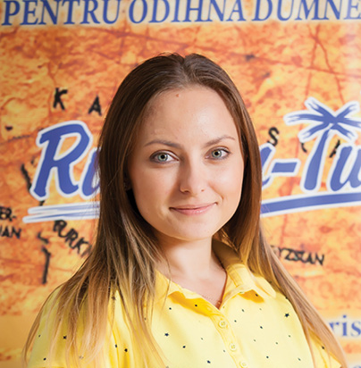

Туристическое агентство Rudmin-Tur - самостоятельная туристическая компания с семейной формой бизнесса и персональной ответственностью!

Rudmin-Tur с 2010 года проверяет то, что предлагает.

Партнеры по всем курортным направлениям проверены нашим персоналом и временем.
Менеджеры компании имеют высшие категории образования в области туризма, экономики, юриспруденции и педагогики.

Наша команда постоянный участник семинаров, тренингов и рабочих информационных туров.

Наша активность включает:
  1. Продажу готовых туристических пакетов
  - виза
  - транспорт
  - проживание в отеле
  - питание
  - страховка
  - трансфер
  2. Индивидуальный подбор тура для туристов, с учетом личных пожеланий.
  3. Организацию экскурсии для детей.
  4. Продажу авиабилетов.

### Наша команда

директор Руденко Светлана - образование высшее педагогическое + категория А

менеджер Руденко Арина - образование высшее педагогическое + экономическое + категория В

менеджер Руденко Елена - образование высшее юридическое + категория В

администратор Руденко Юрий - образование высшее экономическое

